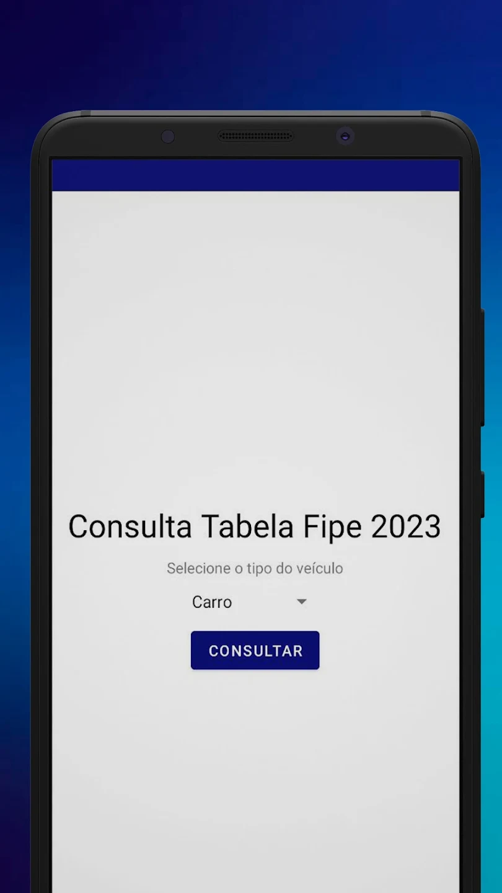
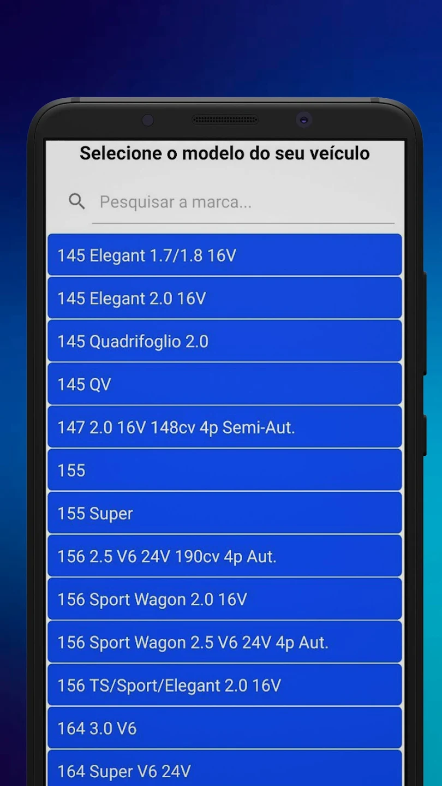
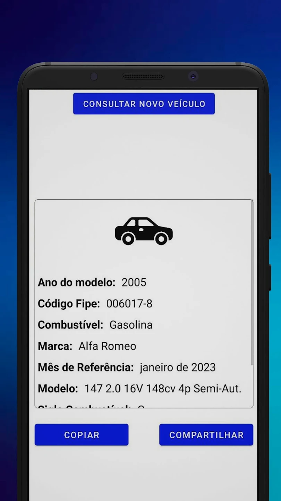

# Aplicativo tabela fipe
Aplicativo de consulta de tabela fipe utilizando a seguinte api pública: https://deividfortuna.github.io/fipe/

## Tecnologias utilizadas

- Kotlin
- Retrofit
- Crashlytics
- Firebase
- Padrões de projeto

## Prints da aplicação:

## Link direto do app na Playstore:
[Aplicativo na Playstore](https://play.google.com/store/apps/details?id=com.geardevelopmentbrazil.tabelafipe "Aplicativo na Playstore")
